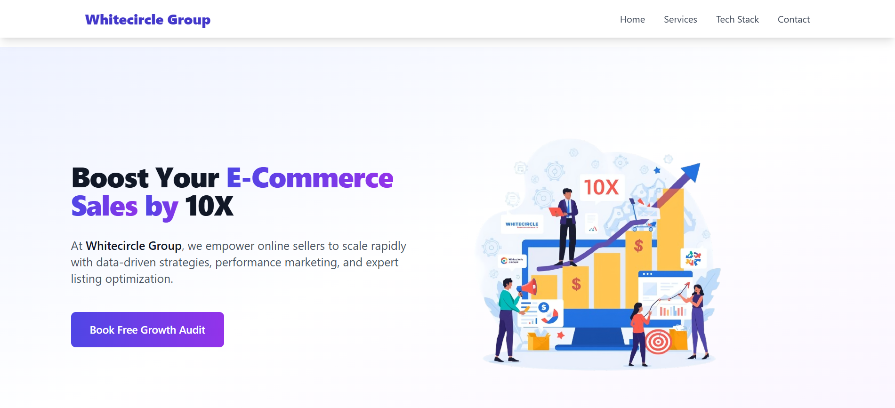

# 🌐 Whitecircle Group - Responsive Website

This is a fully responsive website built as an internship assessment for **Whitecircle Group**. It showcases a modern design using **React.js** and **Tailwind CSS**, covering essential business sections like Hero, Services, Tech Stack, Testimonials, Contact Form, and Footer.

---

## 🚀 Tech Stack

- ⚛️ React.js (Vite)
- 🎨 Tailwind CSS v3
- 📦 React Icons
- 🔁 React CountUp (for animated stats)
- 📸 Google Maps Embed

📁 Folder Structure

whitecircle-template/
├── src/
│ ├── components/
│ ├── App.jsx
│ ├── main.jsx
│ └── index.css
├── public/
├── index.html
├── tailwind.config.js
├── postcss.config.js
└── README.md

| Desktop View | Mobile View |
|--------------|-------------|
|  |  |

---## ✨ Features

- ✨ Fully Responsive Layout (Mobile + Desktop)
- 🖼️ Hero Section with CTA
- 📊 Animated Statistics using CountUp
- 💬 Testimonials in premium card layout
- 🧠 Why Choose Us section with icons
- ⚙️ Services grid with hover animation
- 💻 Technology Stack with logos
- 📍 Google Maps integration
- 📥 Functional Contact Form
- 🧾 Elegant Footer with social links and gallery
- 🔄 Smooth transitions and hover effects

